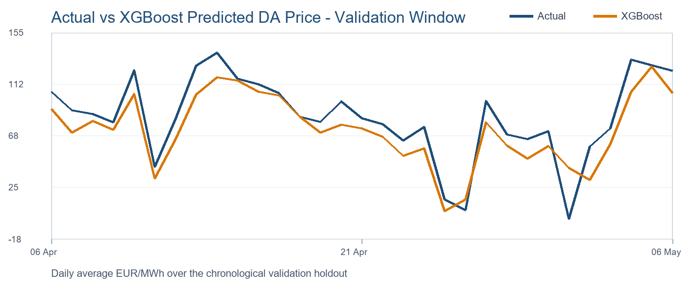

# European Power Fair Value Pipeline

Python pipeline for forecasting Germany/Luxembourg (`DE-LU`) day-ahead power prices and translating the model output into a prompt-curve trading view.

The project demonstrates an end-to-end workflow:

- SMARD API ingestion for hourly market and fundamental power data
- Data QA for missing values, timestamp continuity, and European DST power days
- Feature engineering for residual load, price lags, rolling averages, and calendar effects
- Baseline versus XGBoost validation on a chronological holdout
- Prompt-curve signal translation using a Front-Week baseload reference
- Programmatic OpenAI API reporting with logged prompts and outputs

## Why This Project

European power prices are strongly affected by renewable generation and residual load. A useful fair-value model needs to handle market-data quirks, avoid time-series leakage, and produce a signal that is conservative enough for trading discussion.

This repository is designed as a reproducible portfolio project rather than a production trading system.

## Repository Structure

```text
src/power_fair_value/
  smard.py          SMARD API ingestion
  qa.py             data quality checks, including 23/25-hour DST validation
  features.py       residual load, price lags, rolling averages, calendar features
  models.py         previous-week baseline, XGBoost model, metrics, feature importance
  curve.py          DA fair value to prompt-curve stance
  llm_component.py  OpenAI API prompt construction and logged LLM output
  pipeline.py       end-to-end orchestration

scripts/
  run_case_study.py command-line runner

outputs/
  metrics.csv, predictions.csv, feature_importance.csv, qa_report.md, prompt_curve_view.md

logs/
  llm_prompt.md, llm_output.md
```

## Data Source

Public source: SMARD, the Bundesnetzagentur electricity market data platform.

Hourly series used:

- Day-ahead market price, `EUR/MWh`
- Forecasted load, `MW`
- Forecasted onshore wind generation, `MW`
- Forecasted offshore wind generation, `MW`
- Forecasted photovoltaic generation, `MW`

The SMARD API uses public endpoints such as:

```text
https://www.smard.de/app/chart_data/{filter}/{region}/index_hour.json
https://www.smard.de/app/chart_data/{filter}/{region}/{filter}_{region}_hour_{timestamp}.json
```

## Model Summary

Validation window: final 30 days of the sample, split chronologically.

| Model | MAE | RMSE | Bias |
| --- | ---: | ---: | ---: |
| Previous-week same-hour baseline | 48.31 | 74.09 | -3.51 |
| XGBoost fundamental model | 19.49 | 33.70 | -10.43 |

The improved model materially outperforms the naive baseline, while still showing a negative bias. That bias is documented rather than hidden: a production version should add marginal-cost drivers such as gas, carbon, coal, outages, temperature, and interconnector flows.

## Validation Chart



The chart is generated from `outputs/predictions.csv`, not manually drawn. It compares daily-average actual day-ahead prices with the model's validation-window predictions.

## Prompt-Curve View

The pipeline compares the latest model fair value against a supplied Front-Week baseload reference via `--front-week-price`.

Example final run:

- Model fair value: `104.56 EUR/MWh`
- Manual Front-Week reference: `110.22 EUR/MWh`
- Fair-value premium: `-5.66 EUR/MWh`
- Decision threshold: validation MAE, `19.49 EUR/MWh`
- Stance: `Neutral / no strong prompt bias`

The model does not force a directional signal when the fair-value spread is inside the model's typical validation error.

## AI/LLM Component

The LLM is not used to forecast prices. It is used after validation to reduce manual reporting work.

`src/power_fair_value/llm_component.py` sends structured JSON containing QA results, model metrics, and curve-view fields to the OpenAI Responses API with:

- `gpt-5.6-luna` by default, overridable with `OPENAI_MODEL`
- a constrained system prompt
- no `temperature` parameter, because GPT-5.6 models do not support it
- logged prompt and output files
- explicit instruction not to invent data

Sample logs are included in:

- `logs/llm_prompt.md`
- `logs/llm_output.md`

## Run Locally

```powershell
python -m venv .venv
.venv\Scripts\activate
pip install -r requirements.txt
copy .env.example .env
```

Add an OpenAI API key to `.env` if you want to run the LLM commentary step. To run the deterministic data/model path without an API key:

```powershell
python scripts/run_case_study.py --start 2025-01-01 --end 2026-05-06 --skip-llm
```

To add a manual Front-Week baseload reference:

```powershell
python scripts/run_case_study.py --start 2025-01-01 --end 2026-05-06 --front-week-price 110.22
```

## Tests

```powershell
pytest
```

The tests include a direct DST check:

- `2025-03-30` has 23 local power-day hours
- `2025-10-26` has 25 local power-day hours

## Notes

This is a research prototype. It is not investment advice and is not a production trading system.
